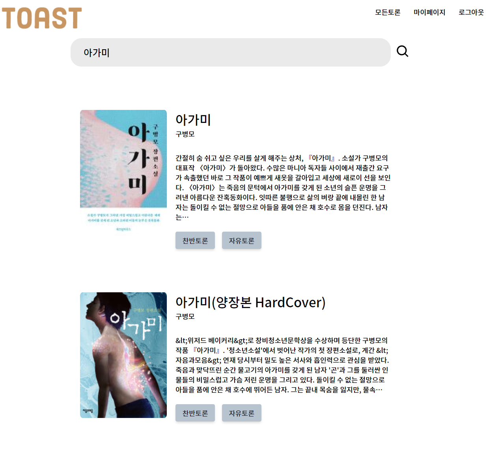
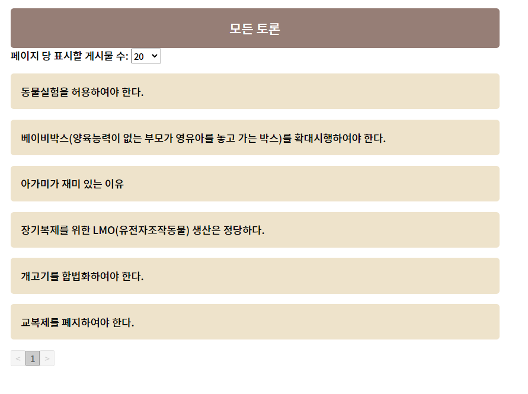
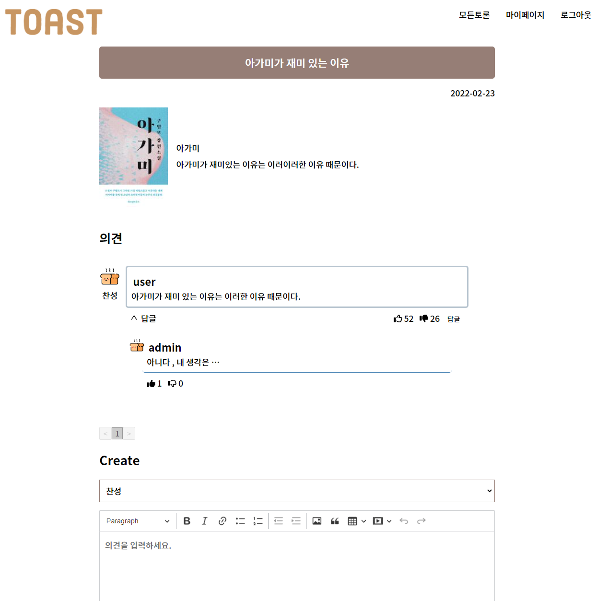
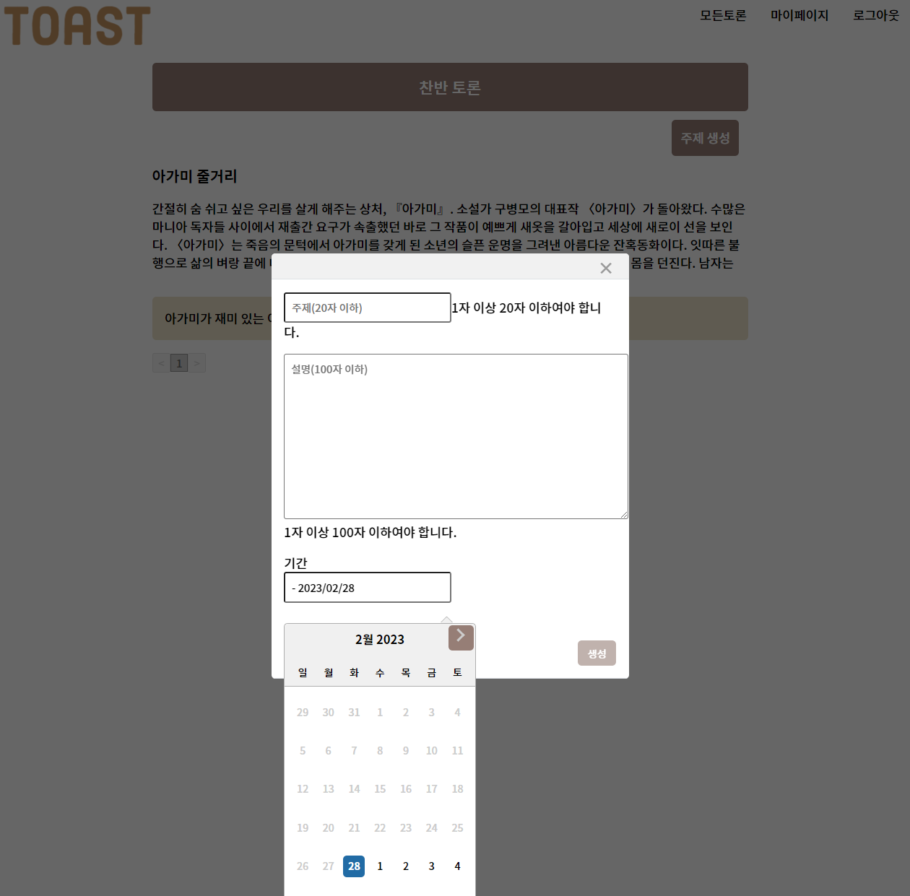

<h1 align="center"> 독서 토론 웹 </h1>

	    

	   

## 독서 토론 웹
> 2022-2 WAP WEB-6   **개발기간: 2022.10 ~ 2022.02**
> 
> 협업레포지토리 : https://github.com/pknu-wap/2022_2_WAP_WEB6
## 배포 주소
> **프론트 서버** : ... 
> **백엔드 서버** : ... 

## 개발
<!-- prettier-ignore-start -->
<!-- markdownlint-disable -->

<table>
  <tr>
    <td align="center"><a href="https://github.com/hennible0612"> 
	    <b>SungWoo Hong</a> 
	    </td>
    <td align="center"><a href="https://github.com/SeojeongHong"> 
	    <b>SeojeongHong</a> 
	    </td>
    <td align="center"><a href="https://github.com/yunjikwak"> 
	    <b>yunjikwak</a> 
	    </td>
  </tr>
    <tr>
    <td align="center">백엔드</td>
    <td align="center">백엔드</td>
    <td align="center">프런트엔드</td>

  </tr>
  
</table>
<!-- markdownlint-restore -->
<!-- prettier-ignore-end -->
## 프로젝트 소개
...

## Stacks
### Development

### Communication

### Deploy

## 화면 구성 📺
| 메인 페이지  |  모든 토론   |
| :-------------------------------------------: | :------------: |
|   |  |  
| 토론 댓글   |  토론 생성   |  
|    |       |

## 주요 기능
### ⭐️ 책 검색
- 카카오 도서 api를 활용하여 책을 검색하여 토론을 주제를 생성

### ⭐️ 토론 하기
- 생성된 토론 주제에서 댓글, 답글을 작성하여 토론이 가능

